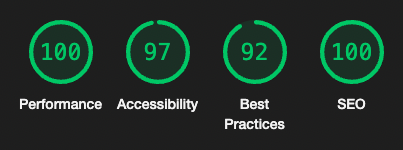

# Cafe Sebastian
## Introduction
Cafe Sebastian is a new (and fictional) cafe in Exeter, UK which hosts a programme live classical music events, alongisde the usual fare of coffee and food.

This website provides visitors with information about opening times, contact details and the upcoming concert series. It also establishes the ethos of the venue thourgh its four core tenets; Founders, Mission, Artists and Community.

### Current Features

The website for Cafe Sebastian is consciously lightweight, with a crips and clean aesthetic; however, it does include a number of features to add structure and increase engagement for visitors.

- Navigation Bar
    - The nav bar is featured prominently at the top of all three pages and allows users to easily navigate betwen the Home, What's On and Contact Us Page. The current page is displayed to the user with coloured text and is underlined.
    - On desktop devices, the bar remains at the top of the users' view, so navigation is available without scrolling. On mobile devices, this detracted from the user experience by obscuring a significant percentage of the screen, so it reverts to remaining at the top of the page on smaller screens.
- Hero Image
    - The large image of the cafe uses a simple zoom animation to attract the eye of the user.
- About Us Images
    - The core tenets of the venue are highlighted for the user in these attractive images- Founders, Mission, Artists, Community.
    - The hover effect reveals more details about each of these areas without cluttering the page with lots of text.
- Event Listing
    - The What's One page is fully responsive for both desktop and mobile devices. 
    - For large screens, it has a pleasing asymmetrical gallery design which allows visitors to see all of the upcoming events at a glance. For smaller devices, it displays with events in a single column, ordered by date.
    - The hover effect, which changes the colours for the relevant event, creates dynamic feedback for the user.
- Contact Us Form
    - The simple form allows visitors to contact the venue directly
- Footer
    - The footer, which appears on every page, displays the opening hours as well as containing links (which open in a new tab) to the relevant social media pages.

### Future Features
Planned future features might include:
- Back to Top button
    - Adding a "Back to Top" button for display on small screens would make returning to the navigation bar easier for the user. Currently, this is not a significant problem, but if the What's On page contained more than 6 events, it might be a useful addition.
- Booking via Whats On page
    - Adding the ability to book for concerts directly through the What's On page would improve the user experience and is likely to help drive ticket sales for the venue.

## Design Elements
The following colour scheme was used throughout the design of the website. It is a palette that was derived from one of the yellow hues of the furniture in the hero image. It offers a neutral palette but with two clear options emphasis.

### Colour Scheme

### Fonts
The two fonts Poppins (for body) and Abril Fatface (for headers) are sourced from Google Fonts.

 ## Testing
 Both the HTML5 and CSS3 code was put through WSC validators and passed without errors.

### HTML
 All pages passed with no errors. The following warning was offered for the Home and What's On pages.

 *Section lacks heading. Consider using h2-h6 elements to add identifying headings to all sections, or else use a div element instead for any cases where no heading is needed.*

I will take this into consideration for future updates.
### CSS 
No errors or warnings were found for the CSS.

## Lighthouse for Chrome
Excellent scores were obtained via Lighthouse trough the Google Chrome DevTools.

### Practical Testing
The website has been tested on the following devices:
- MacBook Pro (14-inch, 2021)
- MacBook (13-inch, early 2014)
- Samsung Galaxy S21
- Samsung Galaxy S20+

It was also rigorously tested using the Chrome Dev tools to check the responsive elements, down to a width of 320px.

 
## Deployment
The site was deployed to GitHub pages. The steps to deploy are as follows:
- In the GitHub repository, navigate to the Settings tab
- From the source section drop-down menu, select the Master Branch
- Once the master branch has been selected, the page will be automatically refreshed with a detailed ribbon display to indicate the successful deployment.

The live link can be found here: https://denham-ed.github.io/sebs_cafe/
 
 ## Credits

### Design Inspiration
- The What's On page of the Kings Place website (https://www.kingsplace.co.uk/whats-on/) was a key influence for the corresponding section of this project.

### Code
- Reece Kenney (via StackOverflow https://tinyurl.com/mry6kjss) - A short section of CSS was used to invert the colours of JS Bach's signature for the footer image

 ### Content
 - copy.ai (an AI-powered copywriter that generates copy based on keywords and short descriptions) was used to generate the About Us copy
 - All other copy is by the developer

### Media
 - Unsplash, Pixabay and Pexels (sites that offer royalty free images) were used to source the photos of venues, staff and performers
 - The photo for the About Us - Artists element is the Myriad Quartet and is used with permission from the artists

 ### Acknowledgements
  - The support my mentor Spencer Barriball for his advice, guidance and directions to resources is gratefully acknowledged.

